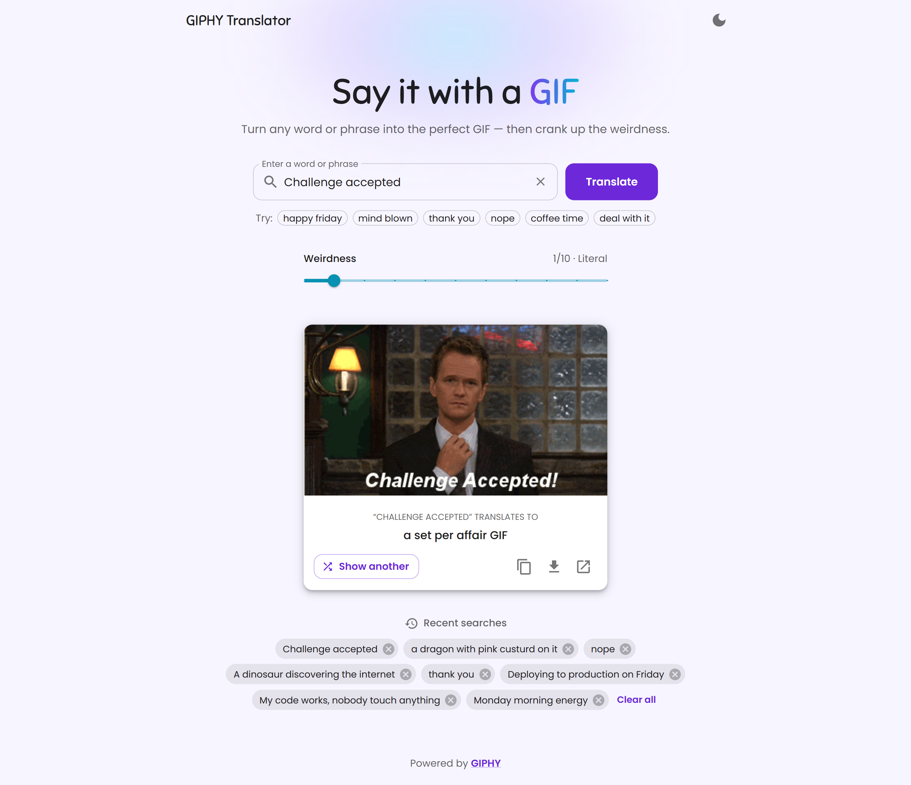

# Giphy Translator

Translate words and phrases into the perfect GIF and add a touch of randomness with the weirdness slider!

This fun and user-friendly application leverages the power of the Giphy API and Material-UI (MUI) to enhance your experience.

## Features

- **GIF Translation:** Instantly convert words and phrases into GIFs.
- **Weirdness Slider:** Customize the level of quirkiness in your GIF selections, from 0 (literal) to 10 (off-the-charts weird).
- **Show Another:** Not feeling the result? Shuffle to a different GIF for the same phrase.
- **Share & Save:** Copy the GIF link, download the GIF, or open it on GIPHY.
- **Recent Searches:** Your last few phrases are saved in the browser so you can jump back to them.
- **Quick Suggestions:** One-click example phrases to get started.
- **Dark Mode:** Follows your system preference, with a toggle that remembers your choice.
- **Keyboard Friendly:** Press `/` to focus the search box and `Enter` to translate.
- **Responsive:** Works nicely on phones, tablets, and desktops.

## Deployed Site

Visit the deployed site [here](https://rizmiya-giphy-translator.surge.sh).

<!-- ## Running Locally

1. Get a free API key from the [GIPHY Developer Dashboard](https://developers.giphy.com/dashboard/).
2. Create a `.env.local` file in the project root:

   ```
   REACT_APP_GIPHY_API_KEY=your_api_key_here
   ```

3. Install dependencies and start the dev server:

   ```
   yarn install
   yarn start
   ```

Run the tests with `yarn test`, and create a production build with `yarn build`.

--- -->

Never be at a loss for the perfect GIF again. Express yourself in a whole new way with Giphy Translator!



## Acknowledgments

- [Giphy API](https://developers.giphy.com/) for providing the awesome GIFs.
